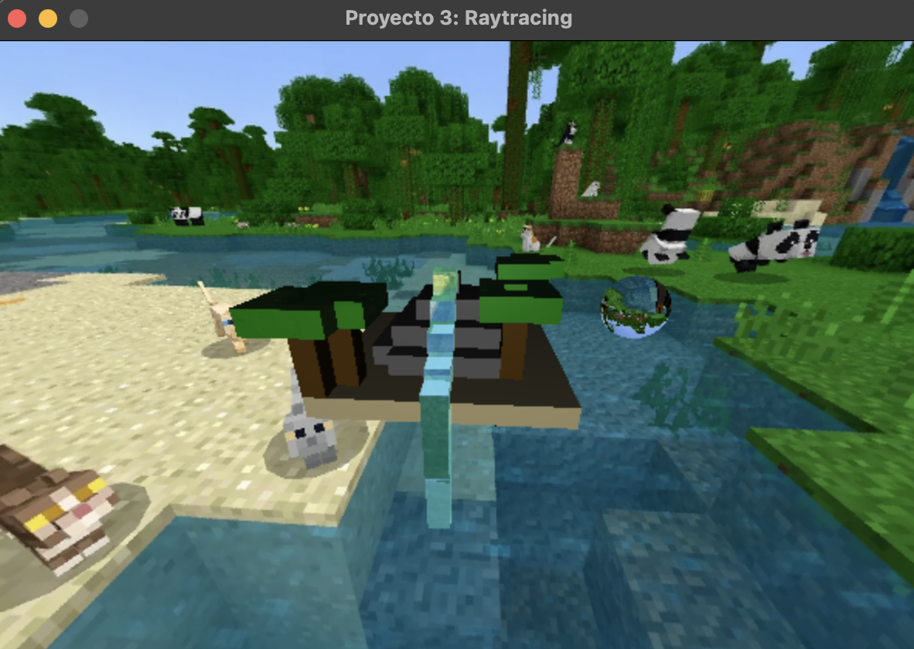
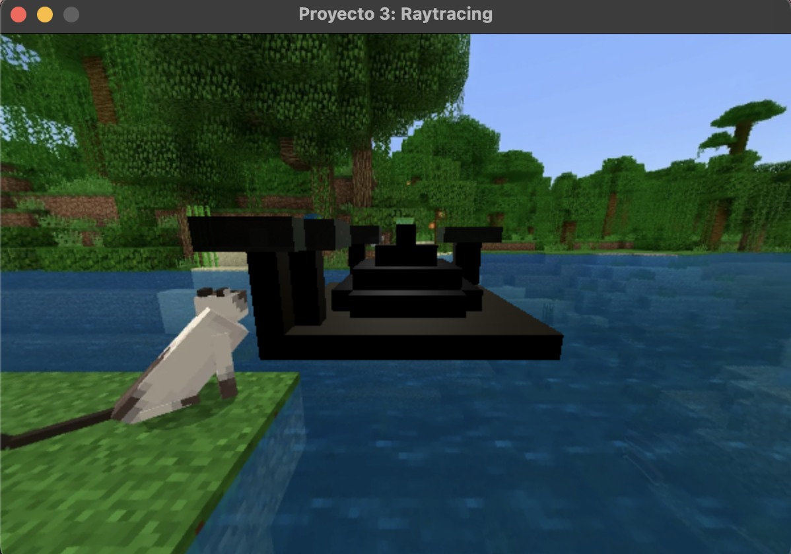
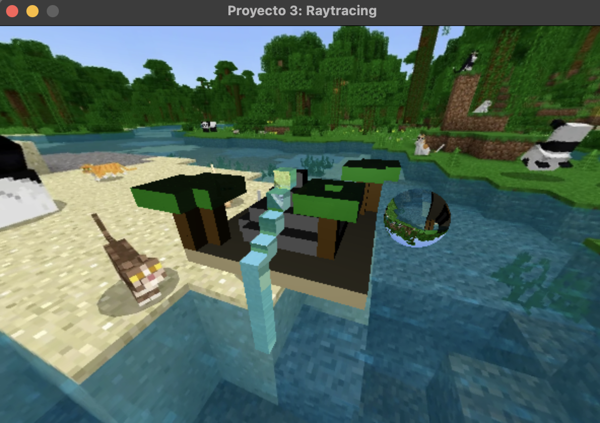
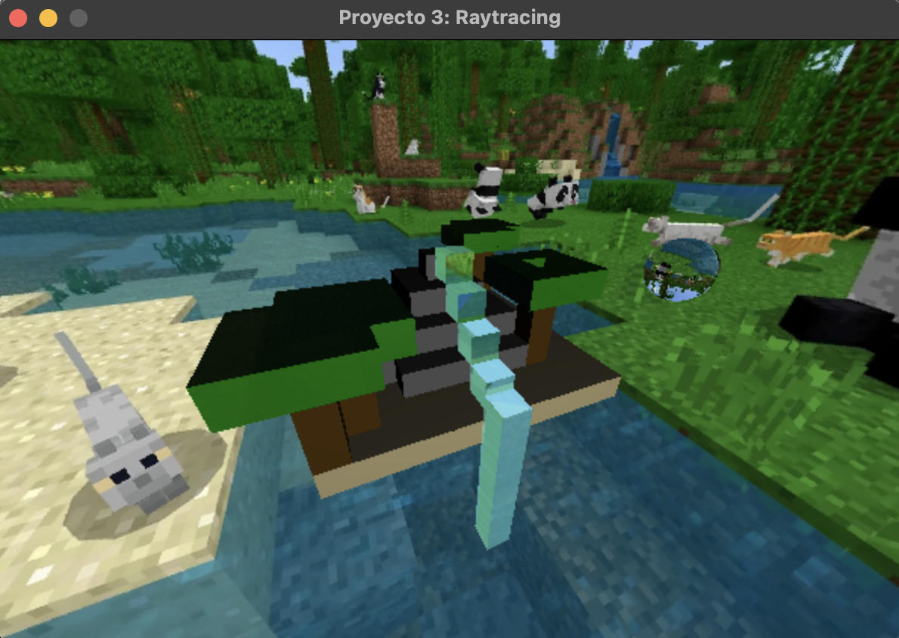

# Proyecto 3: Raytracing

Pequeño diorama utilizando cubos texturizados y agregando efectos de raytracing.

## Objetivo

Que los estudiantes pongan en práctica todos los conocimientos adquiridos sobre raytracing

## Rúbrica

| Puntos | Descripción                     |
| :-------- | :-------------------------------- |
| `30 pts`      | Escena compleja |
| `20 pts`      | Escena visualmente atractiva: skybox de minecraft y plataforma con 5 arboles, una montaña y una cascada, al lado una esfera de vidrio. |
| `20 pts`      | Por implementar rotación en su diorama y dejar que la camara se acerque y aleje |
| `25 pts`      | 6 materiales diferentes implementados: stone, water, leaves, wood, sand, glass  |
| `10 pts`      | Implementar refracción |
| `5 pts`       | Implementar reflexión  |
| `20 pts`      | Implementar Skybox |

**Total:** 130 pts

## Escena del diorama

### Escena de frente

### Escena de atras

### Escena de lado derecho

### Escena de lado izquierdo

